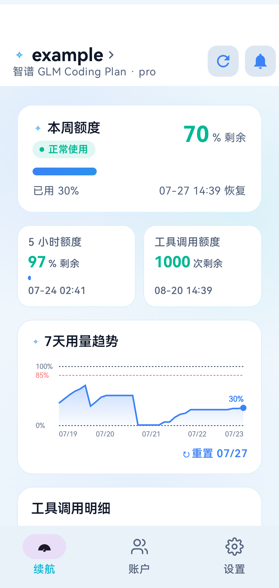
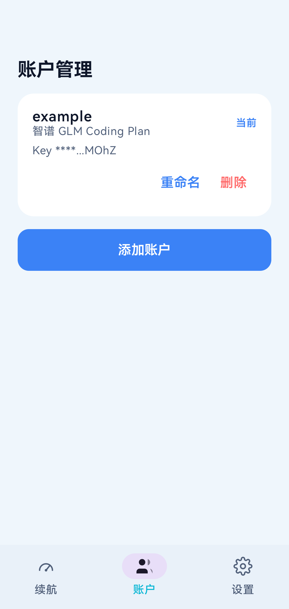
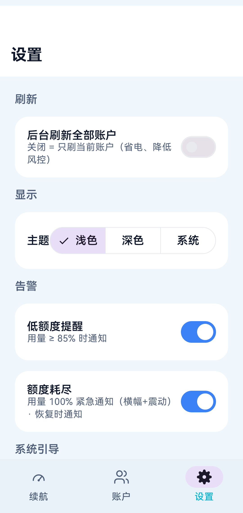
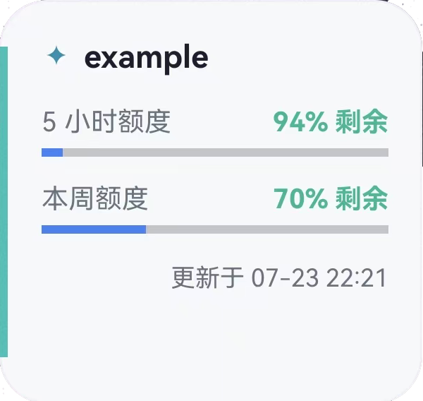
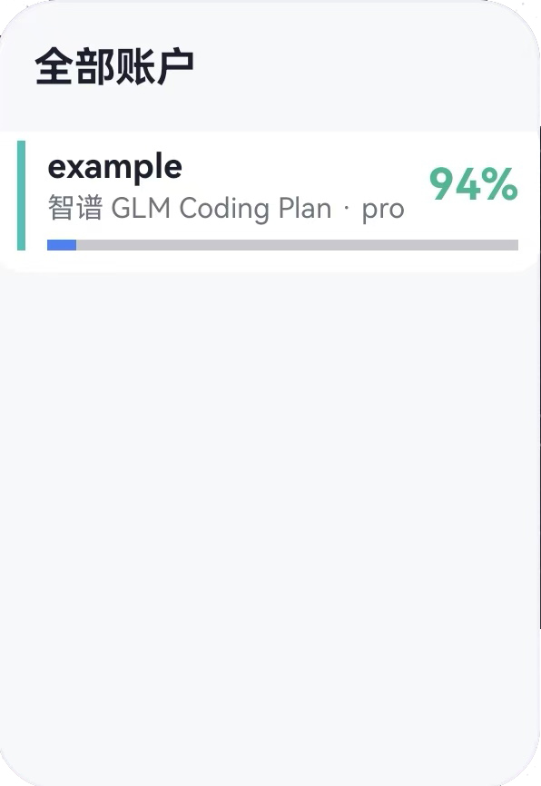

<div align="center">

# ⚡ GlintAPI

**Android AI Coding Plan 用量查看工具，支持智谱 GLM / Kimi / MiniMax 多服务商多账户，App 内 + 桌面 Widget。**

[]()
[]()
[]()
[](android/app/build.gradle.kts)
[](LICENSE)

[简体中文](README.md) · [文档](docs/) · [路线图](docs/ROADMAP.md) · [架构](docs/ARCHITECTURE.md)

<br>

</div>

---

## ✨ 核心亮点

- 📊 **多服务商聚合** — 智谱 GLM（个人版+团队版）、Kimi、MiniMax，一屏查看所有额度
- 📱 **桌面 Widget** — 单账户详情卡片 + 多账户列表卡片，数据一眼可见
- 🔐 **本地加密存储** — API Key 经 EncryptedSharedPreferences 加密，不上传云端
- ⚡ **低频刷新策略** — 手动优先 + 30min 后台 + 前台过期刷新，降低风控风险
- 🎨 **品牌化设计** — GlintAPI 冷光蓝青配色、mesh splash、动效系统
- 🔔 **额度告警** — 两档系统通知（85% 低额度 / 100% 耗尽），滞回死区防重复

---

## 从这里开始

GlintAPI 让你在手机桌面快速查看 AI Coding Plan 的用量余量。配置服务商 API Key 后，通过 App 或桌面 Widget 即可查看 5 小时/周额度、工具调用额度、重置时间和使用趋势。

| 你想要... | 推荐入口 |
|---|---|
| 先看看产品能做什么 | [产品预览](#产品预览) |
| 快速上手 | [快速开始](#快速开始) |
| 理解系统结构 | [系统架构](#系统架构) 和 [能力地图](#能力地图) |
| 参与开发 | [开发指南](#开发指南) |

---

## 为什么选择 GlintAPI

使用 AI Coding Plan 的开发者经常需要确认"5h 窗口/周额度还剩多少"，但每次都要打开网页、登录、点好几下。GlintAPI 做了一个 Android App + 桌面小部件，配好 API Key 后，桌面一滑就能看到余量、重置时间、状态；数据本地缓存、离线仍可查看。

| 多服务商 | 桌面 Widget | 本地优先 | 告警与趋势 |
|---|---|---|---|
| GLM 个人/团队版、Kimi、MiniMax，一屏聚合 | 单账户详情 + 多账户列表卡片 | Key 本机加密，不上传云端 | 两档告警、7 天趋势图 |

---

## 产品预览

| 续航主页 | 账户管理 | 设置页 |
|:---:|:---:|:---:|
|  |  |  |

| 单账户详情 Widget | 多账户列表 Widget |
|:---:|:---:|
|  |  |

---

## 系统架构

GlintAPI 采用分层架构，Provider 隔离让加服务商不动 UI/Widget/缓存：

```text
┌─────────────────────────────────────────────────────────────────┐
│                   Android App（单 Activity Compose）              │
│                                                                   │
│  UI 层 (ui/)                       Widget 层 (widget/)            │
│  ┌───────────────────┐            ┌─────────────────────────┐   │
│  │ MainActivity      │            │ QuotaWidgetProvider      │   │
│  │  ├ UsageScreen    │            │  └ WidgetRenderer        │   │
│  │  ├ AccountsScreen │            │ QuotaListWidgetProvider  │   │
│  │  └ AddAccountScr  │            │  └ QuotaListRemoteViews… │   │
│  └─────────┬─────────┘            │ QuotaRefreshWorker       │   │
│            │ UsageViewModel        │  (默认仅刷 active)       │   │
│            ▼                      └────────────┬────────────┘   │
│  服务层 (services/) ─────────────────────────────────────────  │
│  ┌──────────────────────────────────────────────────────────┐ │
│  │ ServiceProviderConfig 数据表 + UsageParser 归一化         │ │
│  │ glm() / glmTeam() / kimi() / minimax()                   │ │
│  │ AccountRepository + AccountStore（加密多账户）           │ │
│  │ UsageCache（schemaV2 分键缓存）                           │ │
│  └──────────────────────────────────────────────────────────┘ │
│            │                                                      │
│  领域层 (domain/) ── UsageSnapshot/Account/Credential/Window     │
└─────────────────────────────────────────────────────────────────┘
                                  │ HTTPS / 低频
                                  ▼
              各服务商用量查询通路（实验性）
```

---

## 能力地图

<details open>
<summary><b>服务商支持</b></summary>

- **智谱 GLM**（个人版 + 团队版）— `TOKENS_LIMIT` 5 小时/周窗口、`TIME_LIMIT` 工具调用额度
- **Kimi** — Bearer 认证，`limit`/`remaining` 绝对值归一化
- **MiniMax** — 剩余百分比转换，支持 Cookie 鉴权历史版本
- **火山方舟 / ZenMux** — 计划中（v2.3+）

</details>

<details open>
<summary><b>数据解析与归一化</b></summary>

- **UsageSnapshot 统一模型** — `providerId`、`windows[]`、`status`、`errorCode`
- **WindowKind 枚举** — `FIVE_HOUR`（5 小时）、`WEEKLY`（周）、`TOOLS`（工具调用）
- **百分比归一化** — 各家上游格式统一到 `0..100` 的 `usedPercent`
- **错误映射** — `AUTH`/`NETWORK`/`NO_PLAN`/`UPSTREAM_CHANGED` 统一错误码

</details>

<details open>
<summary><b>多账户管理</b></summary>

- **Account 模型** — `accountId`、`providerId`、`label`、`credential`、`isActive`
- **加密存储** — `EncryptedSharedPreferences`（AES256）Key 加密，Keystore 不可用时安全降级
- **活跃账户切换** — per-account RefreshService，独立节流/退避/失败状态
- **账户重命名** — 自定义标签，区分同服务商多账户

</details>

<details open>
<summary><b>Widget 与刷新</b></summary>

- **单账户详情 Widget** — Sparkle 标题 + 服务商品牌色条 + 进度条
- **多账户列表 Widget** — ListView 纵向展示 + 品牌色区分 + 无 divider 设计
- **WorkManager 后台刷新** — 30min 间隔，默认仅刷 active + skip stop-code 账户
- **前台过期刷新** — App 回前台且距上次成功 ≥15min 时静默刷新

</details>

<details open>
<summary><b>告警与趋势</b></summary>

- **两档系统通知** — `WARN` 85% 低额度、`EXHAUSTED` 100% 耗尽、`RECOVERY` 恢复通知
- **滞回死区** — 防重复告警，`AlertStateStore` 记录 armed 状态
- **通知记录** — `NotificationLogStore` 留存事件流（最多 100 条）
- **7 天用量趋势** — `WeeklyTrendCard` Canvas 折线 + Y 轴百分比 + 85% 告警线

</details>

<details open>
<summary><b>UI 与品牌</b></summary>

- **GlintAPI 品牌** — 冷光蓝青配色（`#3B82F6` → `#06B6D4`）、深夜底 `#0E1530`
- **Mesh Splash** — 渐变网格 + 闪烁光标动效
- **动效系统** — 刷新旋转、tab 水平 slide、pushed Fade+Scale、数字进度微动效
- **主题跟随** — 浅/深/自动，Widget 深浅色自动适配
- **空态设计** — EmptyState 方案 B（chip + icon + 文案）

</details>

---

## 快速开始

### 环境要求

- **JDK 21**（AGP 9.x 要求，系统默认 Java 8 不行）
- **Android SDK** — compileSdk 36.1 / minSdk 26 / targetSdk 36
- **Gradle** — 配置阿里云镜像（国内环境）

### 编译 APK

```bash
cd android
JAVA_HOME=/path/to/jdk21 ./gradlew :app:assembleDebug
```

产物：`android/app/build/outputs/apk/debug/app-debug.apk`

### 单测

```bash
./gradlew :app:testDebugUnitTest
```

> **注意**：host JVM 单测需 `org.json:json` 依赖替代 android.jar 的 org.json stub（已在 `build.gradle.kts` 配置）

### 真机调试

```bash
/g/AndroidSDK/platform-tools/adb devices
/g/AndroidSDK/platform-tools/adb install -r android/app/build/outputs/apk/debug/app-debug.apk
```

> Git Bash 下 `adb shell` 带 `/sdcard` 等路径要加 `MSYS_NO_PATHCONV=1`（防路径被转成 `C:/Program Files/Git/...`）

---

## 配置说明

### 国内环境编译坑

| 问题 | 解决方案 |
|---|---|
| Google Maven `dl.google.com` 不通 | 已在 `settings.gradle.kts` 配置阿里云镜像 |
| JDK 版本过低 | 必须用 JDK 21（AGP 9.x 强制） |
| 单测 RuntimeException | 加 `testImplementation("org.json:json:20240303")` |
| Git Bash adb 路径转换 | `MSYS_NO_PATHCONV=1 adb shell ...` |

### 首次配置

1. 打开 App，点击「开始配置」
2. 选择服务商（智谱 GLM / Kimi / MiniMax）
3. 选择区域（国内站/国际站，GLM 团队版仅国内站）
4. 输入 API Key（GLM 团队版需三件套：Key + orgId + projectId）
5. 点击「测试并保存」

> **安全提示**：Key 仅存于本机加密存储，不会上传至开发者服务器

---

## 开发指南

### git commit / push checklist

1. **commit 前**：staged 里不能有 `.key` / `.env` / 明文 token
2. **commit 后**：`git show --name-status HEAD` 核对文件列表
3. **新增文件多时**：`git check-ignore -v <关键新文件>` 抽查
4. **push**：默认 `--force-with-lease`，不用裸 `--force`

### Widget 开发注意

**RemoteViews 不支持裸 `<View>`** — 用了静默失败卡"加载中"。色条用 `ImageView` + `setBackgroundColor`。

**华为 ROM ProgressBar tint 坑** — `setProgressTint`/`setProgressBackgroundTint` 未实现，调了 inflate 失败白屏。解法：进度条颜色只用 XML 静态值。

### 加服务商流程

按 `provider-integrator` agent 契约：

1. `ServiceProviderConfig` 加工厂函数（`newProvider()`）
2. `UsageParser` 加 `parseXxx()` 函数
3. 单测验证全链路（URL、认证头、错误映射、解析）

---

## 项目结构

```text
android/app/src/main/java/com/example/myapplication/
├─ MainActivity.kt              # 单 Activity + Compose 路由 + 生命周期
├─ GlintSplash.kt               # GlintAPI 品牌 splash（mesh 渐变 + 闪烁光标）
├─ domain/
│  └─ Models.kt                 # UsageSnapshot/Account/Credential/Window
├─ services/
│  ├─ ServiceProviders.kt       # ServiceProviderConfig 数据表 + 注册表
│  ├─ UsageParser.kt            # parseGlm/parseKimi/parseMiniMax
│  ├─ UsageProvider.kt          # HttpExecutor/HttpResponse/Region
│  ├─ OkHttpExecutor.kt         # OkHttp 实现
│  ├─ ErrorMapper.kt            # 错误映射
│  ├─ AccountStore.kt           # 加密多账户存储
│  ├─ AccountRepository.kt      # 读 facade（active 选择 + 缓存读取）
│  ├─ UsageCache.kt             # schemaV2 缓存
│  ├─ SettingsStore.kt          # 非敏感设置
│  └─ UsageRefreshService.kt    # per-account 编排
├─ ui/
│  ├─ UsageViewModel.kt         # 多账户 ViewModel + notifyWidgets
│  ├─ Navigation.kt             # Tab/PushedScreen 枚举
│  ├─ EmptyState.kt             # 空态方案B
│  ├─ Snackbar.kt               # GlintSnackbar 分级
│  └─ theme/                    # Compose 主题（NordVPN 蓝 + GlintAPI 品牌）
└─ widget/
   ├─ QuotaWidgetProvider.kt         # 单账户详情 widget
   ├─ QuotaListWidgetProvider.kt     # 多账户列表 widget
   ├─ QuotaListRemoteViewsService.kt # 列表 widget RemoteViewsService
   └─ QuotaRefreshWorker.kt          # WorkManager 后台刷新
```

---

## 文档导航

| 文档 | 内容 |
|---|---|
| [PRODUCT.md](docs/PRODUCT.md) | 产品需求（PRD） |
| [ARCHITECTURE.md](docs/ARCHITECTURE.md) | 架构设计 |
| [ROADMAP.md](docs/ROADMAP.md) | 路线图（v1.1 → v3.9.0） |
| [REVIEW.md](docs/REVIEW.md) | 项目审阅与关键决策 |
| [v2-provider-research.md](docs/v2-provider-research.md) | 各服务商用量契约调研 |
| [ADR-0001](docs/adr/0001-glm-coding-plan-usage-direct-key.md) | GLM 直连数据契约 |
| [ADR-0009](docs/adr/0009-glintapi-brand.md) | GlintAPI 品牌落地 |
| [ADR-0010](docs/adr/0010-v38-experience-bundle.md) | v3.8 体验深化任务包 |

---

## 许可证

[](LICENSE)

---

## 免责声明

本项目为**开源学习交流**用途，通过用户自己的 API Key 查询各家服务商套餐用量，不收集、不上传、不存储任何凭据至开发者服务器。各用量查询端点均为非公开 / 实验性接口，可能随上游规则变化而失效。本项目**不隶属于**智谱、月之暗面、MiniMax 等任何服务商。如本项目侵犯了任何服务商权益，请提 issue 联系移除。

---

<div align="center">

<h3>⚡ GlintAPI</h3>

<p><em>一眼查看 AI Coding Plan 用量，本地优先、安全可控。</em></p>

<br>

<table>
  <tr>
    <td align="center">
      <a href="docs/">
        <br>
        <sub>使用文档</sub>
      </a>
    </td>
    <td align="center">
      <a href="docs/ROADMAP.md">
        <br>
        <sub>路线图</sub>
      </a>
    </td>
    <td align="center">
      <a href="https://github.com/arisewind/glint-api">
        <br>
        <sub>代码仓库</sub>
      </a>
    </td>
  </tr>
</table>

</div>
